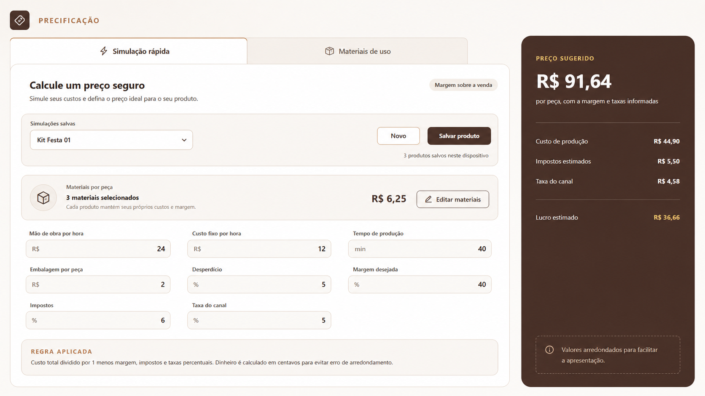
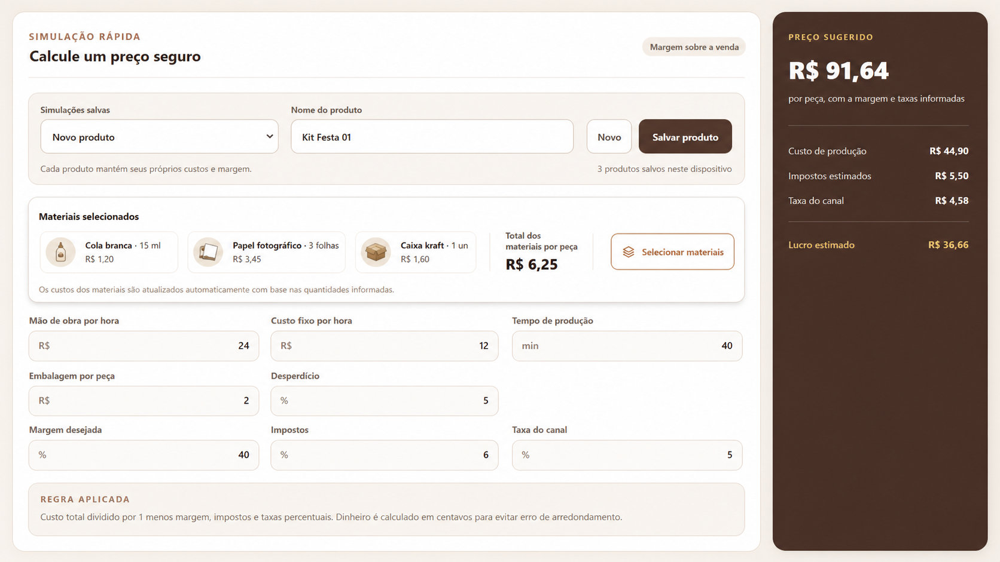
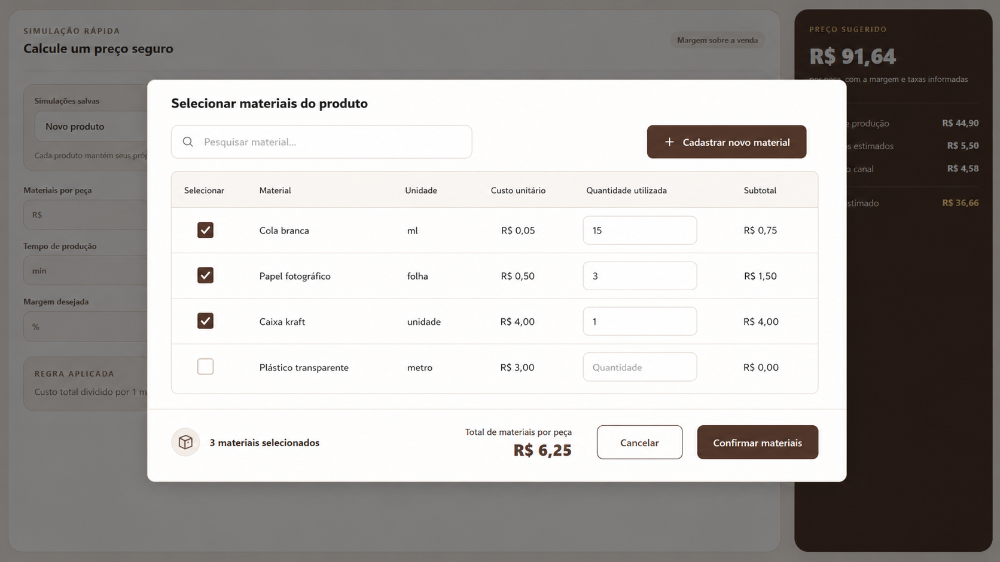
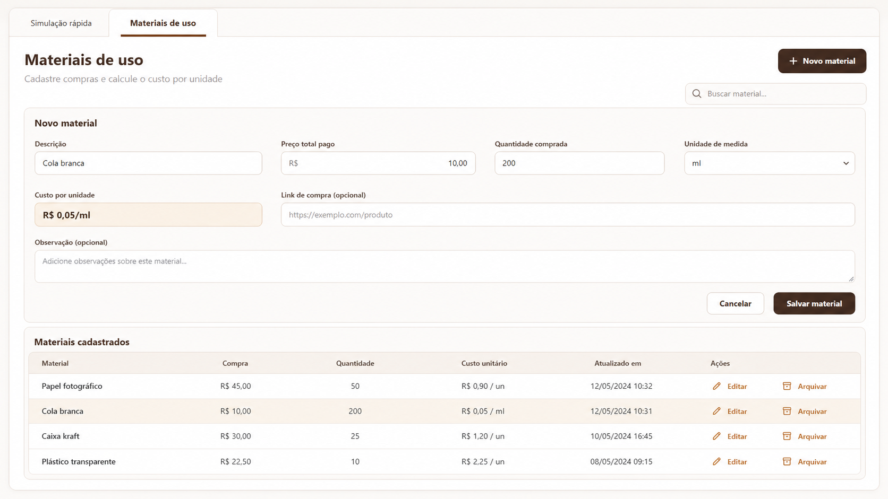

# Roadmap — Materiais de uso na Precificação

## Objetivo

Transformar o valor manual de **Materiais por peça** em uma composição
rastreável de materiais cadastrados. Cada produto poderá usar vários materiais,
com quantidade própria, custo automático e persistência no banco local e nos
backups do Ambro Studio. Essa composição funcionará como uma **receita própria
do produto** e será restaurada sempre que o produto for selecionado novamente.

## Status da entrega

| Fase | Status |
|---|---|
| Domínio e cálculo | Concluída |
| Persistência, migração e backup | Concluída |
| Aba Materiais de uso | Concluída |
| Seletor de materiais | Concluída |
| Integração e retenção por produto | Concluída |
| Testes e empacotamento desktop | Concluída na versão 0.4.0 |
| Quantidades, revenda e aproveitamento A4 | Concluída na versão 0.7.0 |

## Layout proposto

A área de Precificação passa a ter duas abas:

1. **Simulação rápida:** mantém a fórmula atual, produtos salvos e preço
   sugerido, substituindo somente o custo manual de materiais por uma composição.
2. **Materiais de uso:** cadastra compras, calcula custo unitário e permite
   editar ou arquivar materiais.

## Simulação rápida

O campo atual de dinheiro será substituído por um resumo interativo. Ele exibirá
os componentes escolhidos, suas quantidades e o total calculado. O botão
**Selecionar materiais** abre o pop-up de composição.

### Comportamento

- Um produto pode ter zero, um ou vários materiais.
- O mesmo material aparece no máximo uma vez; uma nova seleção altera a
  quantidade existente.
- Ao reabrir um produto salvo, materiais e quantidades voltam preenchidos.
- O botão **Salvar produto** grava em uma única operação todos os campos da
  precificação, os materiais selecionados e a quantidade usada de cada um.
- Trocar de produto carrega automaticamente a receita vinculada ao produto
  escolhido; materiais de um produto nunca são compartilhados acidentalmente
  com outro.
- Um produto novo começa sem materiais selecionados.
- O total de materiais entra automaticamente na fórmula de preço já existente.
- Alterar um preço de compra recalcula os produtos vinculados quando eles forem
  abertos ou exibidos novamente.
- Cancelar o pop-up não altera a composição atual.

## Pop-up de seleção

O pop-up ocupa a maior parte da área útil e reúne pesquisa, seleção múltipla,
quantidades, subtotais e criação rápida de um material.

### Colunas

| Coluna | Regra |
|---|---|
| Selecionar | Ativa ou remove o material da composição temporária. |
| Material | Descrição cadastrada. |
| Unidade | Unidade definida no cadastro, sem edição dentro do pop-up. |
| Custo unitário | Calculado a partir da última compra informada. |
| Quantidade utilizada | Valor positivo; aceita frações quando necessário. |
| Subtotal | Custo proporcional à quantidade utilizada. |

### Ações

- **Pesquisar material:** filtra por descrição.
- **Cadastrar novo material:** abre o mesmo formulário usado na aba de
  materiais, sem sair do fluxo. Depois de salvo, o novo material aparece na
  tabela e pode ser selecionado.
- **Cancelar:** descarta somente as alterações feitas desde a abertura.
- **Confirmar materiais:** valida as quantidades, salva a composição temporária
  na simulação e atualiza o preço sugerido.

## Aba Materiais de uso

### Cadastro

| Campo | Obrigatório | Regra |
|---|---:|---|
| Descrição | Sim | Texto curto que identifica o material. |
| Preço total pago | Sim | Dinheiro positivo, armazenado em centavos. |
| Quantidade comprada | Sim | Número positivo e diferente de zero. |
| Unidade de medida | Sim | Unidade, folha, ml, litro, grama, kg, cm ou metro. |
| Custo por unidade | Calculado | Preço pago dividido pela quantidade comprada. |
| Link de compra | Não | Somente endereço `https`; aberto fora do aplicativo. |
| Observação | Não | Texto livre do material; nunca enviado aos logs. |

O material deve ser cadastrado na unidade em que normalmente é consumido. Por
exemplo: uma embalagem com 1 litro de cola que será consumida em mililitros é
cadastrada como `1.000 ml`. Assim a quantidade usada na simulação sempre utiliza
a mesma unidade do cadastro, sem conversões ambíguas.

### Exemplo de cálculo

| Material | Compra | Quantidade comprada | Custo unitário | Uso no produto | Subtotal |
|---|---:|---:|---:|---:|---:|
| Cola branca | R$ 10,00 | 200 ml | R$ 0,05/ml | 15 ml | R$ 0,75 |
| Papel | R$ 50,00 | 100 folhas | R$ 0,50/folha | 3 folhas | R$ 1,50 |
| Caixa | R$ 80,00 | 20 unidades | R$ 4,00/un | 1 unidade | R$ 4,00 |
| **Total** |  |  |  |  | **R$ 6,25** |

Para não acumular erro de arredondamento, o sistema não salvará apenas o custo
unitário arredondado. Ele guardará o preço total em centavos e a quantidade da
compra. Cada subtotal será calculado pela proporção:

`subtotal = preço total pago × quantidade usada ÷ quantidade comprada`

O arredondamento para centavos acontecerá somente no subtotal final.

## Modelo de dados

### Material

| Propriedade | Finalidade |
|---|---|
| `id` | Identificador estável. |
| `description` | Descrição do material. |
| `purchasePriceCents` | Preço total pago em centavos. |
| `purchasedQuantity` | Quantidade total comprada. |
| `measurementUnit` | Unidade usada na compra e no consumo. |
| `purchaseUrl` | Link opcional validado. |
| `notes` | Observação opcional. |
| `archived` | Retira das novas seleções sem quebrar produtos existentes. |
| `createdAt` / `updatedAt` | Controle técnico local. |

### Material utilizado no produto

| Propriedade | Finalidade |
|---|---|
| `materialId` | Referência ao material cadastrado. |
| `usedQuantity` | Quantidade utilizada por peça do produto. |

O produto salvo guardará referências e quantidades, não cópias de descrição,
link ou observação.

### Receita persistente por produto

Cada produto de precificação terá sua própria lista `materialUsages`. Por
exemplo:

| Produto | Material | Quantidade usada |
|---|---|---:|
| Kit Festa | Papel fotográfico | 12 folhas |
| Kit Festa | Cola branca | 20 ml |
| Caixa Presente | Papel fotográfico | 4 folhas |
| Caixa Presente | Cola branca | 5 ml |

Ao selecionar **Kit Festa**, o sistema recupera as 12 folhas e os 20 ml. Ao
selecionar **Caixa Presente**, recupera as 4 folhas e os 5 ml. Voltar ao Kit
Festa restaura novamente sua composição salva, junto com mão de obra, tempo,
desperdício, margem, impostos e taxa do canal. Custos antigos de embalagem são
preservados como legado visível até a pessoa removê-los; novas embalagens são
cadastradas como materiais.

Alterações feitas no formulário só passam a compor a receita persistente depois
de **Salvar produto**. Se houver mudanças ainda não salvas e a pessoa tentar
trocar de produto ou criar um novo, o sistema deverá pedir confirmação para não
descartar o trabalho silenciosamente.

## Persistência, backup e diagnóstico

- O catálogo ganhará um documento validado próprio no SQLite.
- A composição será incluída no documento dos produtos de precificação.
- Campos da precificação e receita de materiais serão persistidos juntos, para
  impedir que apenas uma parte do produto seja salva em caso de falha.
- O backup `.ambrobackup` incluirá catálogo e vínculos automaticamente.
- A restauração validará o catálogo antes de substituir os dados atuais.
- Logs poderão registrar apenas operações e códigos técnicos, como
  `MATERIAL_SAVE_FAILED`; descrição, observação, URL, preço e quantidade nunca
  entrarão no diagnóstico.
- Um material vinculado não será apagado: será arquivado e continuará disponível
  para os produtos que já o utilizam.

## Compatibilidade com produtos existentes

Os produtos atuais possuem um valor manual de materiais. A migração não poderá
zerar nem alterar seus preços silenciosamente.

1. O valor existente será preservado como **Custo manual anterior**.
2. O resumo indicará que aquele produto ainda utiliza um valor legado.
3. Ao confirmar uma composição de materiais, o valor legado será substituído
   pelo total calculado.
4. Salvar ou abrir um produto antigo continuará funcionando antes da conversão.

## Etapas de implementação

### Fase 1 — Domínio e cálculo

- Criar o contrato de material e as unidades aceitas.
- Implementar cálculo proporcional sem perda prematura de centavos.
- Criar validações de descrição, preço, quantidade, URL e observação.
- Criar testes de cálculo, frações, valores extremos e arredondamento.

### Fase 2 — Persistência e migração

- Criar o repositório local do catálogo de materiais.
- Liberar a nova chave na ponte segura do Electron e no SQLite.
- Estender produtos salvos com materiais e quantidades.
- Garantir persistência isolada da receita de cada produto.
- Migrar valores manuais existentes sem alterar o resultado atual.
- Validar criação e restauração de backup com o novo documento.

### Fase 3 — Aba Materiais de uso

- Construir abas acessíveis na Precificação.
- Criar formulário reutilizável de material.
- Implementar listagem, pesquisa, edição e arquivamento.
- Exibir custo unitário calculado em tempo real.
- Abrir links de compra somente por `https` no navegador externo.

### Fase 4 — Seletor de materiais

- Construir o pop-up grande e responsivo.
- Implementar seleção múltipla, busca e quantidade por material.
- Calcular subtotal por linha e total geral em tempo real.
- Integrar criação rápida sem perder a seleção em andamento.
- Manter alterações isoladas até a confirmação.

### Fase 5 — Integração com a simulação

- Substituir o campo manual pelo resumo de materiais.
- Recalcular custo de produção, preço sugerido e lucro.
- Salvar e restaurar a composição de cada produto.
- Carregar automaticamente campos e receita ao selecionar outro produto salvo.
- Alertar antes de trocar de produto quando existirem alterações não salvas.
- Exibir materiais arquivados apenas quando já vinculados.

### Fase 6 — Qualidade e entrega

- Testar teclado, foco, rolagem e fechamento do pop-up.
- Testar telas menores e textos/valores grandes.
- Executar testes, lint, TypeScript, build e teste do aplicativo empacotado.
- Validar backup antes e depois da atualização.
- Publicar uma nova versão pelo atualizador já implantado.

### Fase 7 — Quantidades, revenda e aproveitamento A4

- Salvar quantidade analisada, unidade comercial e quantidade mínima de
  revenda em cada precificação.
- Multiplicar consumo de materiais, tempo, mão de obra e custo fixo pela
  quantidade simulada.
- Aplicar desperdício sobre materiais, mão de obra e custo fixo.
- Comparar automaticamente 1, 10, 20, 50, 100 e uma quantidade personalizada.
- Exibir custo total e unitário, preço mínimo e sugerido, venda e lucro total.
- Calcular o aproveitamento de uma folha A4 de 21 × 29,7 cm, sem rotação,
  arredondando a quantidade de folhas sempre para cima.
- Impedir que o papel selecionado para A4 também seja cobrado como consumo
  normal na mesma precificação.
- Salvar e restaurar a configuração A4 junto da receita do produto.
- Migrar precificações anteriores sem apagar materiais, preços ou custos de
  embalagem já existentes.

## Critérios de aceite

1. É possível cadastrar, editar, pesquisar e arquivar um material.
2. Observação e link são opcionais e persistem após reiniciar o aplicativo.
3. O custo unitário e os subtotais seguem a fórmula definida.
4. É possível selecionar vários materiais para o mesmo produto.
5. Cada material possui quantidade usada e unidade visível.
6. Confirmar atualiza imediatamente o preço sugerido; cancelar não altera nada.
7. A criação rápida adiciona o novo material sem fechar o pop-up principal.
8. Produtos salvos recuperam sua composição corretamente.
9. Alternar entre dois produtos recupera materiais e quantidades diferentes de
   cada receita, sem misturar as composições.
10. Salvar um produto persiste todos os campos e sua receita na mesma operação.
11. Alterações não salvas não são descartadas silenciosamente ao trocar de
    produto.
12. Produtos antigos mantêm o preço até terem o custo manual substituído.
13. Catálogo e composições sobrevivem a backup e restauração.
14. Nenhum dado de material aparece nos logs técnicos.
15. A atualização instalada preserva todos os dados existentes.
16. As quantidades padrão e personalizada apresentam resultados coerentes.
17. O aproveitamento A4 informa unidades por folha, folhas necessárias e custo.
18. Quantidade, unidade comercial, revenda e A4 voltam preenchidos ao reabrir a
    precificação.

## Fora do escopo desta entrega

- Controle de estoque ou baixa automática de saldo.
- Histórico de fornecedores e múltiplas compras do mesmo material.
- Alertas de reposição.
- Conversão automática entre unidades diferentes.
- Relatórios de consumo.

Esses itens podem formar uma evolução posterior sem alterar a fundação desta
feature.
